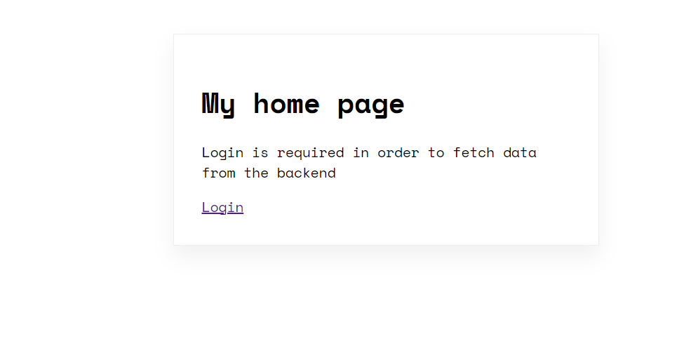
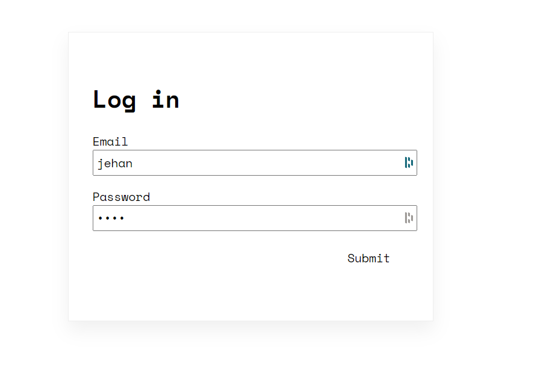
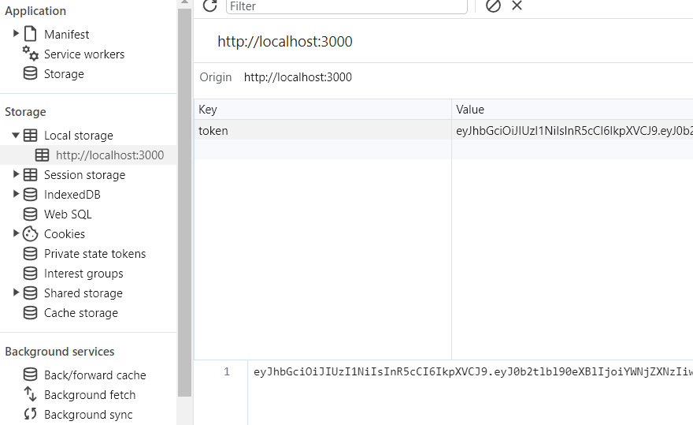
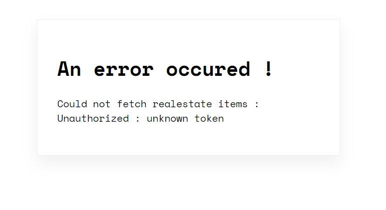
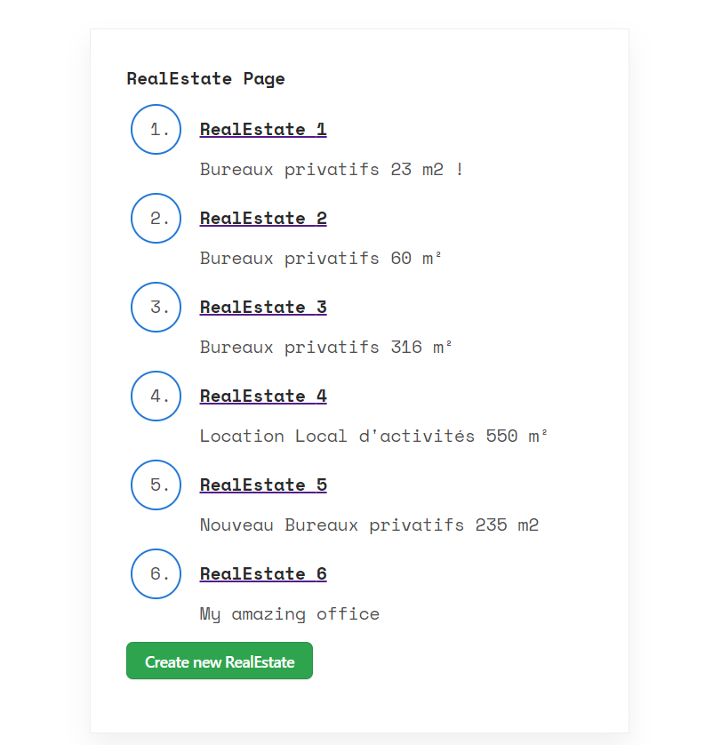
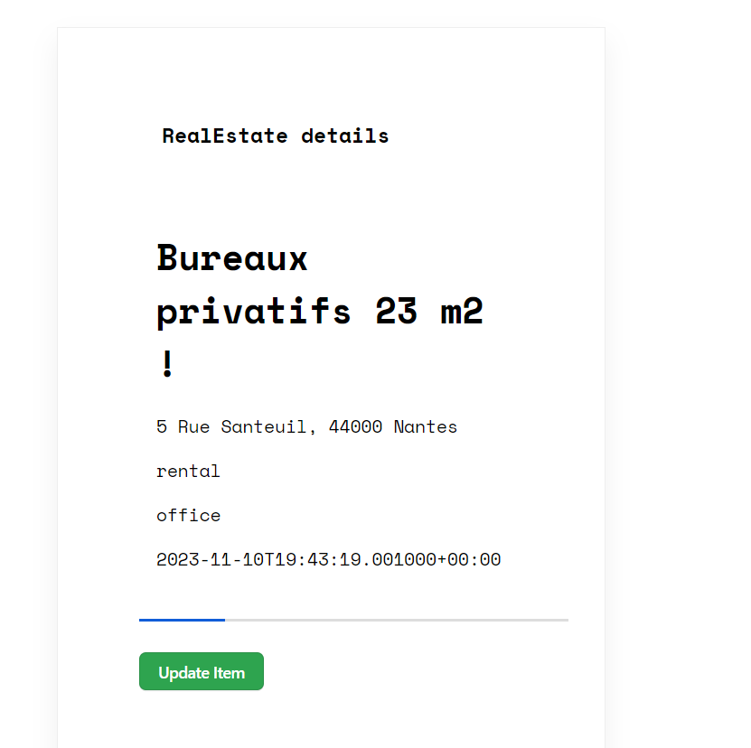
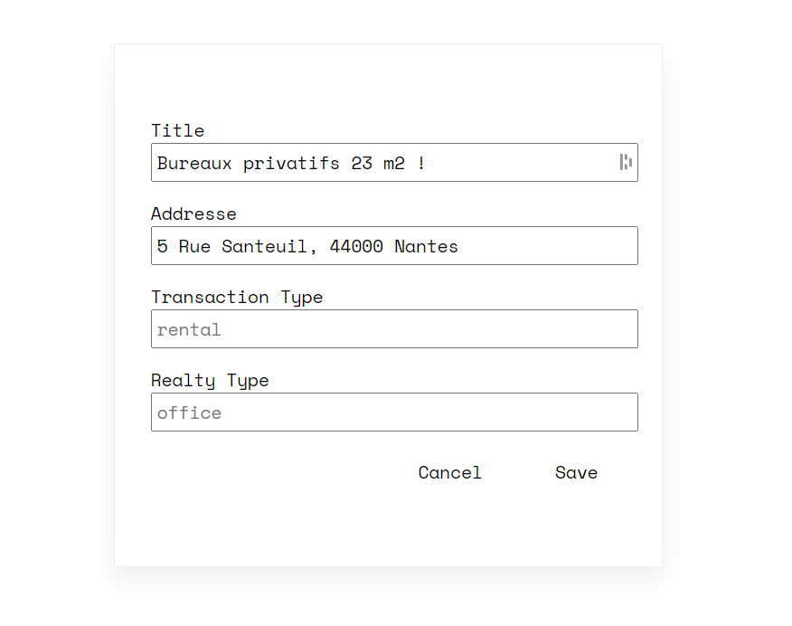
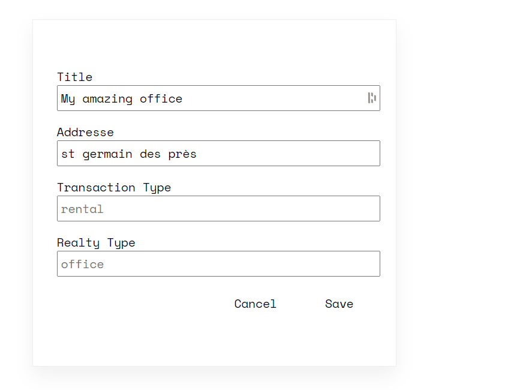

# Fullstack Application Django/React

## Installation method

1. Clone this Repo

   `git clone https://github.com/Cyrano71/TestBureauxLocaux.git`

2. cd into the TestBureauxLocaux folder:

   `cd TestBureauxLocaux`
   
2. deploy the backend by using the docker command :

   `docker compose up`
   
It will deploy a postgres database and a django rest api server.
For the django we use the following packages :
- psycopg2
- django-cors-headers
- djangorestframework-simplejwt

The docker deployment will automatically populate the input data into the database (see [this sample](backend/api/fixtures/sample.json) )
and will automatically create two users:
- one admin user with username = "admin", password = "1234"
- one normal user with  username = "jehan", password = "1234"

3. in a new terminal, cd into the frontend react app folder

   `cd frontend`

4. install the dependencies

   `npm install`
   
We use as dependencies:
- react-router

4. Start the frontend app

   `npm run start`

## Use the application

The url is : http://localhost:3000/

1. When you will first use the application you will need to log into the backend



2. Then you will have a log in form automatically populated with the credential of the user jehan



3. As soon as the authentication is done with the backend you will receive an authentication token
that will be stored in the local storage of your browser:



4. If you try to skip the authentification step you will receive an Unauthorized response from the backend:



5. With this token you will have access to the list of real estate items in the postgres database:



6. If you click on the title of the item you will have access to the details of the item:



7. You can update the item by clicking on the button and you will be redirected to the update form
automatically populated with the data of the item. 

For the Transaction type you will have only theses choices:
- rental or sale

For the Realty type  you will have only theses choices:
- office, land plot, warehouse, retail or coworking



8. In the the list of real estate items you have a button to create a new item:


9. It will redirect you to the add page:



## UniTests

### Backend Django unitests

1. You cd into the backend folder:

 `cd backend`

2. You provide the credentials of your dev database in the env file :

   ```
   DEV_DB_ENGINE= django.db.backends.mysql
   DEV_DB_HOST=localhost
   DEV_DB_NAME=
   DEV_DB_PORT=3306
   DEV_DB_USER=
   DEV_DB_PASSWORD=
   ```

   [env file](backend/backend/.env)

3. You also need to install in your conda env the requirements:

 ```
 conda create --name mytestenv
 conda activate mytestenv
 pip3 install -r requirements.txt
 ```

4. You run the tests with this command :

 `python manage.py test`

You can find the code of the tests here : [tests code](backend/api/tests.py)

### Frontend React unitests

1. you cd into the frontend folder:

 `cd frontend`

2. you run the tests with commands :

 `npm test`

You can find the code of the tests here : [tests code](frontend/src/pages/Products.test.js)

## References

For the css I would like to thank mattc0m
You can find his work on this link : https://codepen.io/mattc0m/pen/rNdMjKX